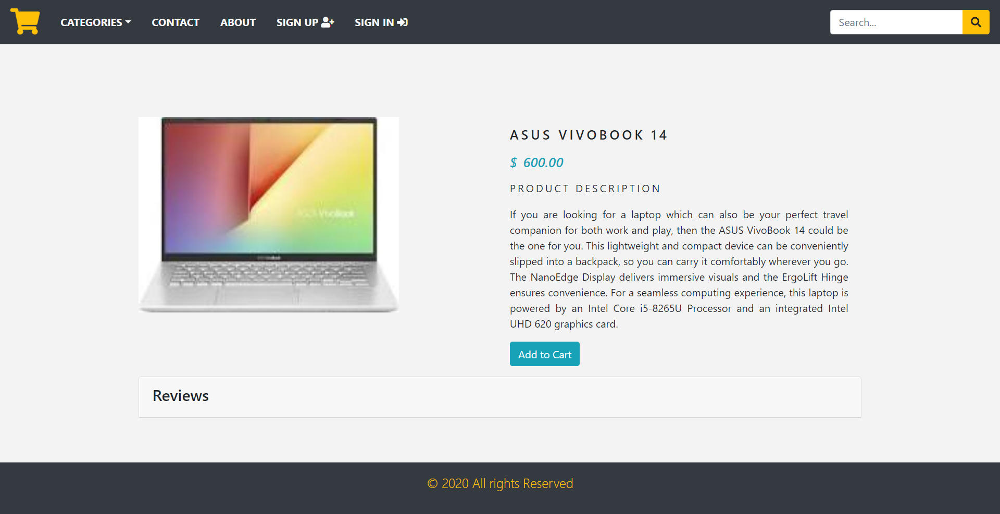
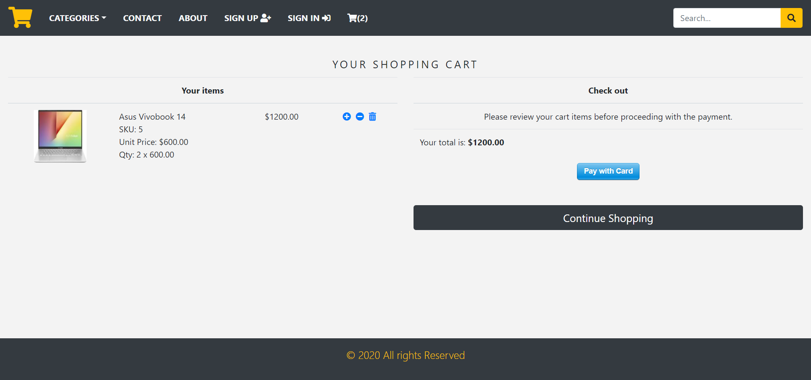
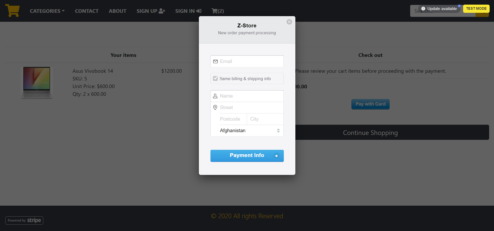
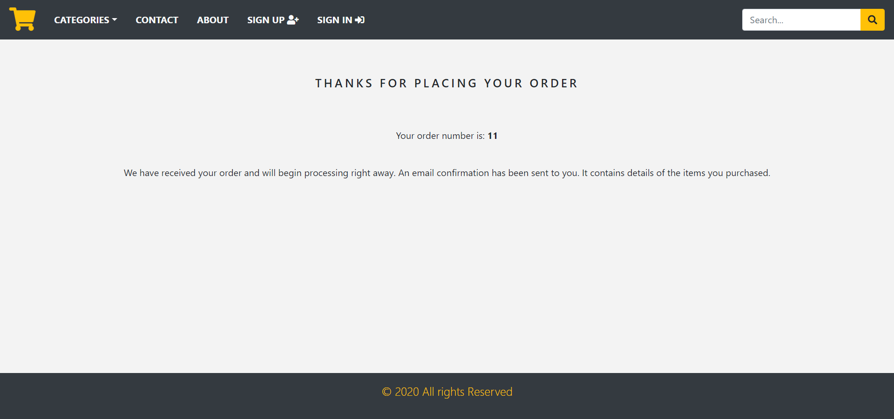

# Introduction 

##### This is an e-commerce site with some functionalities such as browsing through products, read reviews about them, and can buy them. The payment gateway is used for users to make payment using Stripe.

##### This is a home page of the website.

##### If user wish to see description about particular product, he can click on it and he will be redirected to product page. From here, he can add that product to the cart.

##### After adding product to the cart, he will be redirected to the checkout page. User can increase or decrease the quantity of the product. He can also pay here by clicking on pay with card button. After that he will get a pop up to complete the payment process.

##### After payment is done, user will get information regarding his order on his email.
